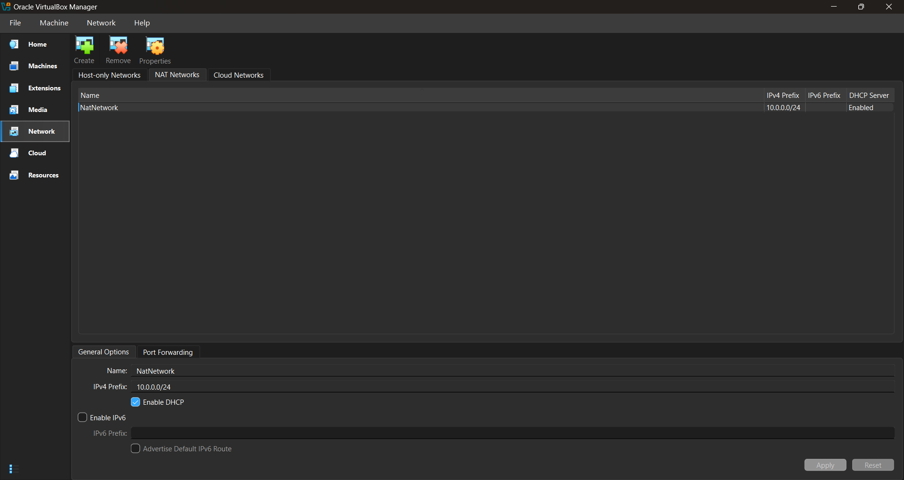
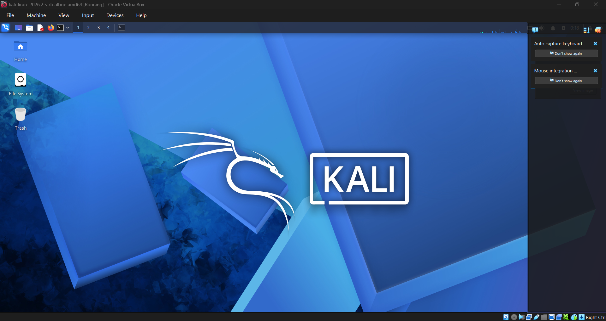
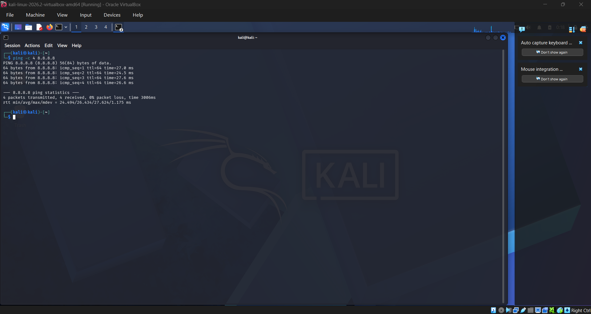
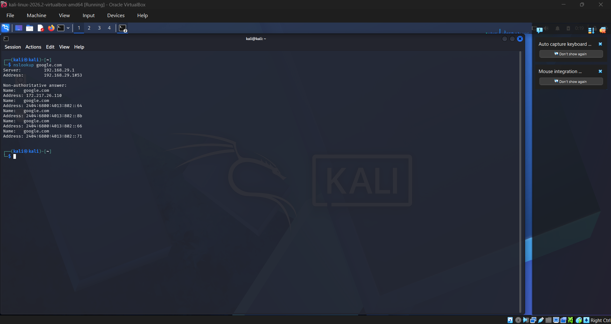
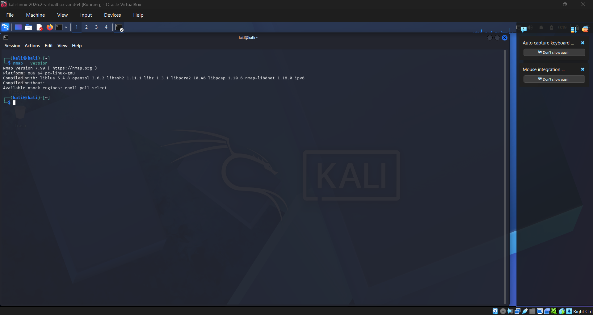

# 🔐 Cybersecurity Lab Environment Setup

### NetworkWalks Cybersecurity Internship | Week 1 | Project 1

---

## 📌 Project Overview

This project was completed as part of the NetworkWalks Cybersecurity Internship – Week 1.

The objective was to build and configure a basic cybersecurity laboratory environment using VirtualBox and Kali Linux. The lab provides a controlled environment for learning networking concepts, testing connectivity, verifying DNS resolution, and practicing cybersecurity tools.

The project involved configuring a virtual NAT Network, connecting Kali Linux to the network, verifying internet connectivity, checking DNS resolution, and confirming the availability of Nmap.

This laboratory environment can be extended in future projects by adding additional virtual machines and performing authorized security testing between them.

---

## 🎯 Project Objectives

The main objectives of this project were:

- Set up a virtual cybersecurity laboratory
- Configure VirtualBox for cybersecurity practice
- Create and configure a NAT Network
- Use the required 10.0.0.0/24 network range
- Connect Kali Linux to the configured virtual network
- Verify network connectivity
- Test DNS resolution
- Verify Nmap installation
- Troubleshoot configuration issues
- Document the complete setup
- Maintain a safe and controlled environment for cybersecurity learning

---

## 🏗️ Lab Architecture

The laboratory environment consists of a Kali Linux virtual machine connected to a VirtualBox NAT Network.

The NAT Network provides connectivity between virtual machines and allows the laboratory to be expanded with additional systems in future projects.

### Current Lab Structure

    Internet
       |
       |
    VirtualBox NAT Network
       |
       |
    +----------------+
    |   Kali Linux   |
    |  Virtual Machine|
    +----------------+
       |
       |
    Cybersecurity Tools
    & Testing Environment

---

## 🧰 Tools and Technologies

| Tool / Technology | Purpose |
|---|---|
| VirtualBox | Virtual machine management and networking |
| Kali Linux | Cybersecurity-focused operating system |
| NAT Network | Virtual network connectivity |
| Nmap | Network discovery and security testing |
| Ping | Network connectivity verification |
| Nslookup | DNS resolution verification |
| 7-Zip | Archive extraction |
| GitHub | Project documentation and storage |

---

## ⚙️ Environment Configuration

### Virtualization Platform

VirtualBox Version: 7.2.16

VirtualBox was used to create and manage the cybersecurity laboratory environment.

### Operating System

Operating System: Kali Linux

Kali Linux was selected because it provides a large collection of tools designed for cybersecurity education, network analysis, penetration testing, and security research.

### Network Configuration

Network Type: NAT Network

Network Range: 10.0.0.0/24

The NAT Network was configured according to the requirements of the NetworkWalks project.

---

## 🌐 NAT Network Configuration

A NAT Network was created inside VirtualBox to provide networking between the virtual machines.

The network was configured using the required:

10.0.0.0/24

network range.

DHCP was enabled to allow the virtual machine to obtain network configuration automatically.

### Configuration Screenshot

---

## 🖥️ Kali Linux Virtual Machine

Kali Linux was imported and configured as the primary virtual machine for the laboratory.

The Kali Linux virtual machine was connected to the previously created NAT Network.

The virtual machine was then started to verify that the operating system could communicate through the configured virtual network.

### Kali Linux Screenshot

---

## 🔌 Network Adapter Configuration

The Kali Linux virtual machine required its network adapter to be enabled and connected to the correct VirtualBox network.

The adapter was configured to use the created NAT Network.

This configuration allowed Kali Linux to communicate through the laboratory network.

---

## 🌍 Network Connectivity Verification

After configuring the network, connectivity was tested from Kali Linux.

The ping command was used to verify communication with an external IP address.

Command used:

    ping -c 4 8.8.8.8

The final connectivity test completed successfully with 0% packet loss.

### Connectivity Screenshot

---

## 🔎 DNS Resolution Verification

After confirming basic network connectivity, DNS resolution was tested.

The nslookup utility was used to verify that a domain name could be resolved successfully.

Command used:

    nslookup google.com

The domain was successfully resolved.

### DNS Verification Screenshot

---

## 🛡️ Nmap Verification

Nmap is an important network discovery and security auditing tool commonly used in cybersecurity laboratories.

The installation was verified using:

    nmap --version

The command successfully displayed the installed Nmap version, confirming that Nmap was available and ready for use.

### Nmap Screenshot

---

## 🧪 Verification Summary

The main components of the laboratory were verified successfully.

| Test | Result |
|---|---|
| VirtualBox NAT Network | ✅ Configured |
| Required Network Range | ✅ Configured |
| Kali Linux VM | ✅ Configured |
| Network Adapter | ✅ Connected |
| Internet Connectivity | ✅ Verified |
| DNS Resolution | ✅ Verified |
| Nmap Installation | ✅ Verified |
| Documentation | ✅ Completed |

---

## 🐞 Troubleshooting and Problems Faced

During the setup, several configuration issues were encountered. Resolving these issues provided practical experience with VirtualBox networking and virtual machine configuration.

### 1. Difficulty Locating Network Settings

Initially, the Network settings required for creating the NAT Network were not immediately visible in VirtualBox.

After checking the available VirtualBox settings, the Network section was located and the required NAT Network configuration was completed.

### Lesson Learned

VirtualBox versions can have different interface layouts, so menu locations may differ between tutorials and installed versions.

---

### 2. NAT Network Had the Wrong Default Range

When the NAT Network was initially created, VirtualBox provided a different default network range.

The project required:

10.0.0.0/24

The network configuration was changed to the required range and DHCP was enabled.

### Lesson Learned

Always verify the network range instead of assuming the default VirtualBox configuration matches the project requirements.

---

### 3. Network Adapter Could Not Be Enabled

The Kali Linux network adapter could not initially be modified because the virtual machine was running.

The virtual machine was powered off first. After that, the network adapter could be enabled and connected to the correct NAT Network.

### Lesson Learned

Some VirtualBox hardware and network settings can only be modified when the virtual machine is powered off.

---

## 📚 Key Learnings

This project helped develop practical understanding of several networking and cybersecurity concepts.

### Virtualization

Learned how virtualization can be used to create isolated environments for cybersecurity training and experimentation.

### Virtual Networking

Learned how to create and configure a NAT Network in VirtualBox and connect a virtual machine to it.

### Network Connectivity

Learned how to use ping to verify whether a system can communicate across a network.

### DNS

Learned how nslookup can be used to verify domain-name resolution.

### Nmap

Verified the installation and availability of Nmap, which will be useful for future network discovery and security-testing exercises.

### Troubleshooting

Gained practical experience diagnosing configuration problems instead of simply following setup instructions.

---

## 🔐 Ethical and Responsible Use

This laboratory environment is intended strictly for educational, authorized, and ethical cybersecurity practice.

Cybersecurity tools such as Nmap can be powerful and should only be used against systems and networks where explicit authorization has been provided.

The purpose of this laboratory is to develop practical cybersecurity and networking skills in a controlled environment.

---

## 🚀 Future Expansion

This laboratory can be expanded in future projects by adding additional virtual machines.

Possible future components include:

- Windows virtual machine
- Additional Linux systems
- Multiple network segments
- Client and server environments
- Network scanning exercises
- Vulnerability assessment labs
- Traffic analysis
- Security monitoring
- Controlled penetration-testing exercises

The goal is to gradually build a more complete cybersecurity laboratory for practical learning.

---

## 📸 Project Evidence

The repository contains screenshots documenting the major stages of the laboratory setup:

1. NAT Network Configuration
2. Kali Linux Virtual Machine
3. Network Connectivity Verification
4. Nmap Version Verification
5. DNS Verification

These screenshots provide visual evidence of the completed configuration and verification steps.

---

## 🗂️ Repository Structure

    NETWORKWALKS-ISHANYA-JHA-B083-WK1-PM1-CYBERSECURITY-LAB-SETUP
    |
    +-- 01-NAT-Network-Configuration.png
    +-- 02-Kali-Linux-VM.png
    +-- 03-Network-Connectivity-Ping.png
    +-- 04-Nmap-Version.png
    +-- 05-DNS-Verification.png
    +-- README.md

---

## 👤 Project Information

| Information | Details |
|---|---|
| Student | Ishanya Jha |
| Internship | NetworkWalks Cybersecurity Internship |
| Week | Week 1 |
| Project | Cybersecurity Lab Environment Setup |
| Virtualization | VirtualBox 7.2.16 |
| Primary OS | Kali Linux |
| Network Type | NAT Network |
| Network Range | 10.0.0.0/24 |

---

## ✅ Project Status

Week 1 Project: Completed

The cybersecurity laboratory was successfully configured, network connectivity was verified, DNS resolution was tested, Nmap installation was confirmed, and the setup was documented with screenshots.

---

### 🔐 NetworkWalks Cybersecurity Internship

Learn • Build • Test • Document
